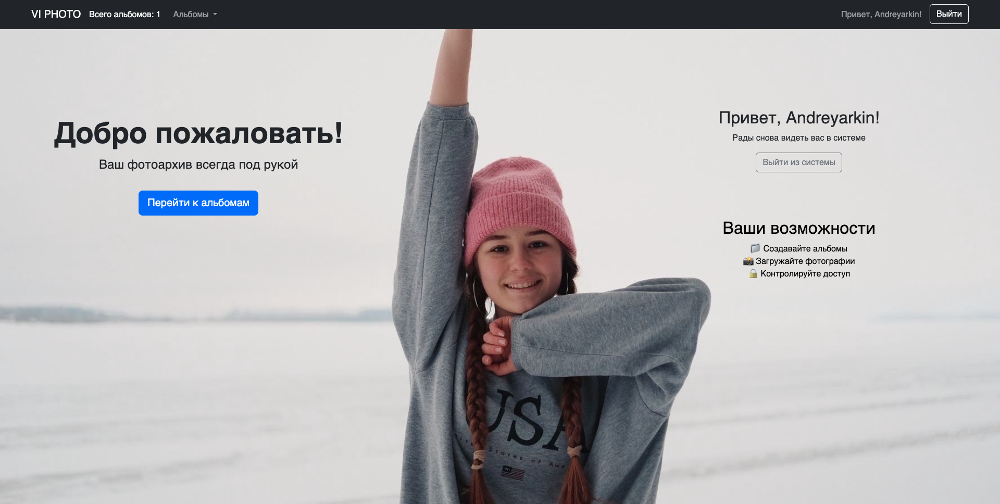
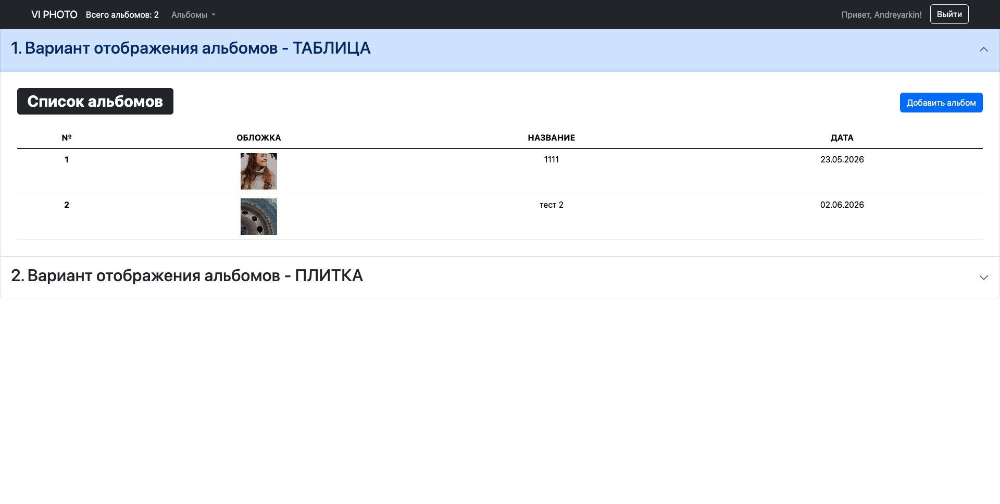
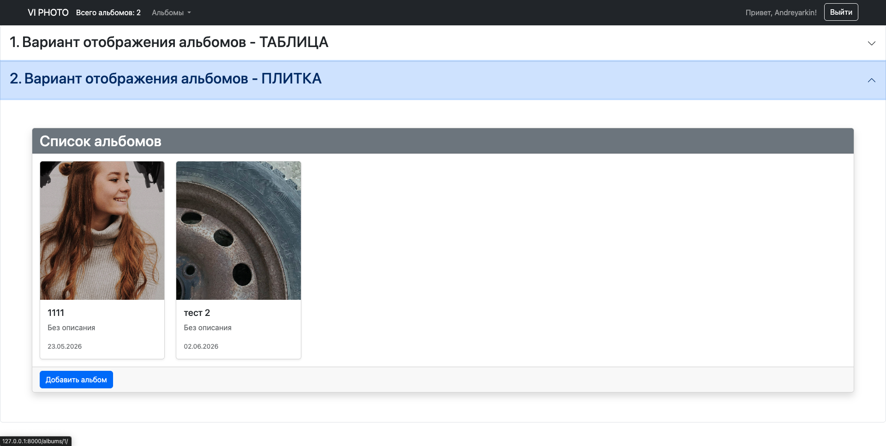
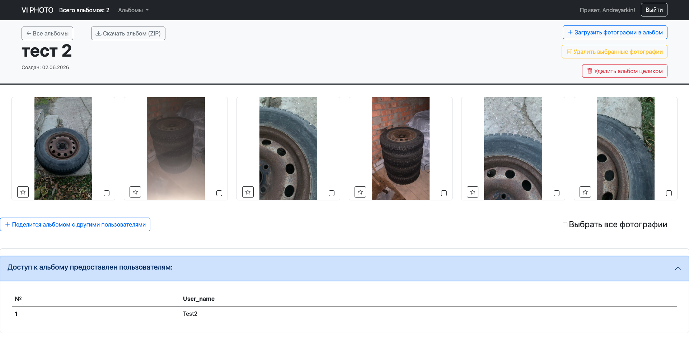
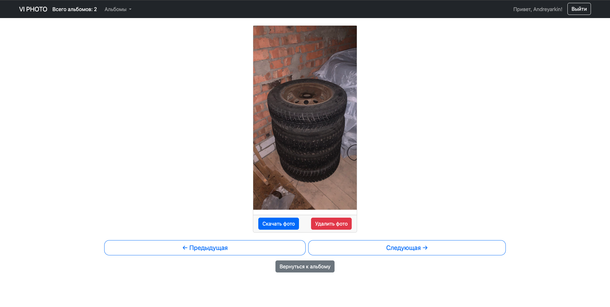

# Vitochka — Django Photo Album Web Application

## Live Demo

https://viphoto35.ru

## Реализовано

- Пользовательская система авторизации
- Разграничение прав доступа (owner / shared)
- Работа с медиафайлами (upload / download)
- REST API на Django REST Framework
- Скачивание альбомов ZIP-архивом
- Совместный доступ к альбомам
- Управление порядком фотографий
- Выбор обложки альбома
- PostgreSQL
- Docker & Docker Compose
- Nginx reverse proxy
- Gunicorn WSGI server
- SSL (Let's Encrypt, HTTPS)
- Pytest

## Описание проекта

Vitochka — это веб-приложение для хранения, организации и совместного доступа к фотографиям в альбомах.

Проект реализован на Django + Django REST Framework и поддерживает управление пользователями, разграничение прав доступа и API для взаимодействия с фронтендом.

Основная цель проекта — создание удобной системы управления фотоальбомами с гибкой моделью доступа, где пользователь может:
- создавать альбомы
- делиться ими
- ограничивать доступ
- управлять содержимым

## Цели проекта
Этот проект создан как:
   * практическое закрепление Django + DRF
   * изучение архитектуры web-приложений
   * освоение production-деплоя (Docker + Nginx + SSL)
   * развитие навыков backend-разработки
   * подготовка к трудоустройству в сфере Python/Django

## Основные функции проекта:
Пользователи:
   * Регистрация и аутентификация пользователей
   * Разграничение ролей (пользователь / администратор / суперпользователь)
   * Управление доступом к альбомам
Фотоальбомы:
   * Создание и удаление альбомов
   * Выбор обложки альбома
   * Изменение порядка фотографий внутри альбома
   * Управление доступом (owner / shared)
Фотографии:
   * Загрузка и хранение исключительно изображений
   * Просмотр и скачивание фотографий
   * Удаление фотографий
   * Привязка к альбомам
Права доступа:
   * Гибкая система permissions
   * Ограничение доступа к альбомам и фотографиям
   * Возможность делиться альбомами с другими пользователями
API:
   * REST API на базе Django REST Framework
   * Возможность интеграции с фронтендом или внешними клиентами
Администрирование:
   * Панель Django Admin
   * Управление пользователями, альбомами и контентом
   * Полный доступ у суперпользователя  

## Технологии и зависимости:
   * Backend: Django 5.1
   * API: Django REST Framework
   * Database: PostgreSQL 
   * WSGI: Gunicorn
   * Web server: Nginx
   * Containerization: Docker, Docker Compose
   * Testing: pytest
   * Frontend templates: Django Templates + Bootstrap
   * Media storage: Django media system
   * Security: HTTPS (Let’s Encrypt SSL)

## Архитектура проекта:

    vitochka/
    │
    ├── vitochka/        # конфигурация проекта 
    ├── viapp/           # основная бизнес-логика
    ├── users/           # система пользователей и авторизация

## Внутренняя архитектура viapp:
   * models.py — модели альбомов и фотографий
   * forms.py — формы Django
   * views.py — веб-интерфейс
   * services.py — бизнес-логика и контроль доступа
   * vitochka/viapp/API/ — REST API слой
   * vitochka/viapp/tests/ — тесты (pytest)

## ## API

Проект предоставляет REST API на базе Django REST Framework.

Основные ресурсы:

### Albums

| Method    | Endpoint            |
| --------- | ------------------- |
| GET       | `/api/albums/`      |
| POST      | `/api/albums/`      |
| GET       | `/api/albums/{id}/` |
| PUT/PATCH | `/api/albums/{id}/` |
| DELETE    | `/api/albums/{id}/` |

Дополнительные операции:

* `GET /api/albums/{id}/download_album/`
* `POST /api/albums/{id}/share_album/`
* `POST /api/albums/{id}/set_album_cover/`
* `POST /api/albums/{id}/reorder_photos/`

### Photos

| Method    | Endpoint            |
| --------- | ------------------- |
| GET       | `/api/photos/`      |
| POST      | `/api/photos/`      |
| GET       | `/api/photos/{id}/` |
| PUT/PATCH | `/api/photos/{id}/` |
| DELETE    | `/api/photos/{id}/` |

Дополнительные операции:

* `GET /api/photos/{id}/download_photo/`
* `POST /api/photos/many_photo_delete/`

## Установка и запуск проекта
1 клонировать репозиторий

    git clone https://github.com/Andreyarkin/vitochka.git
2 перейти в директорию проекта

    cd путь_к_проекту    
3 активировать виртуальное окружение

для Windows: 

    ll_env\Scripts\activate 
для MacOS:
      
    source ll_env/bin/activate     
4 установить зависимости:

    pip install -r requirements.txt
5 выполнить миграции:
   
    python manage.py migrate
6 создать суперпользователя:
    
    python manage.py createsuperuser
7 запустить сервер разработки:
    
    python manage.py runserver
8 открыть в браузере: 
> в адресной строке браузера введите или нажмите на ссылку:
    http://127.0.0.1:8000/

## Тестирование
Для запуска тестов запустить команду

    pytest

## Запуск через Docker
Проект поддерживает контейнеризацию:

    docker-compose -f docker-compose.dev.yml up --build

## Демонстрация работы проекта:

Проект развернут на VPS с использованием:

   * Docker Compose
   * Nginx reverse proxy
   * Gunicorn
   * SSL (Let’s Encrypt)
   * Domain: https://viphoto35.ru

## Скриншоты

### Главная страница

### Список альбомов
варинат отображения 1

варинат отображения 2

### Альбом

### Просмотр фотографии

## Автор
Андрей Яркин  
[andrey.yarkin24@gmail.com](mailto:andrey.yarkin24@gmail.com)
[andrey-yarkin@yandex.ru](mailto:andrey-yarkin@yandex.ru)